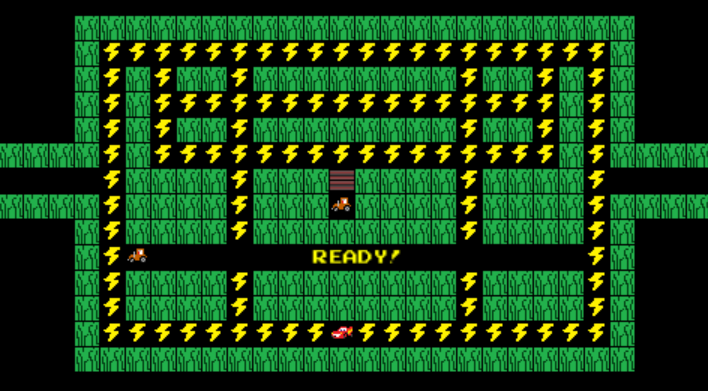
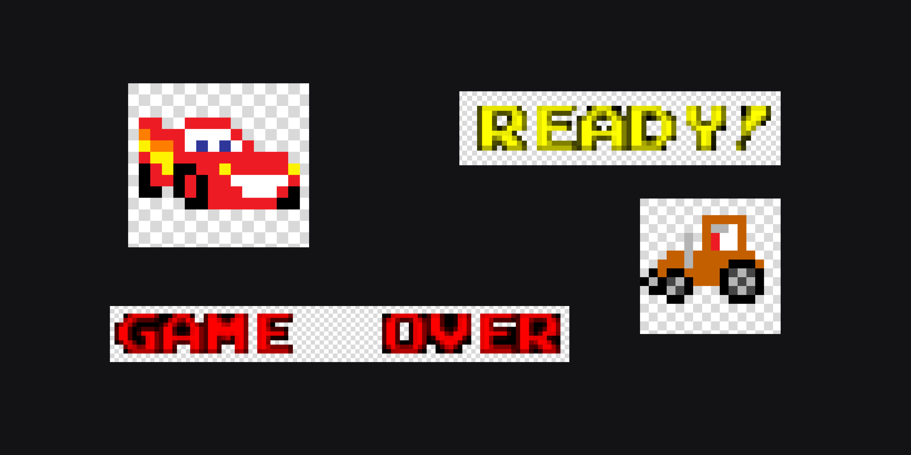

# Mcqueen-Game
Jogo do Relâmpago Mcqueen 🚗⚡ estilo pac man, criado utilizando python e a biblioteca pygame.

> Pac-Man é um clássico jogo de arcade onde o jogador controla o personagem, que se move por um labirinto com o objetivo de comer todos os pontos, enquanto evita ser capturado por quatro inimigos coloridos. À medida que o jogador avança pelos níveis, o labirinto se torna mais desafiador, acontecendo o crescimento do mapa. 

## 💻 Modificações e personalização

Neste jogo fizemos adaptações para um jogo de pac-man personalizado. Foram feitos pixels art para representar o personagem Relâmpago Mcqueen do desenho "Carros", os raios, grama e os tratores que são seus inimigos durante o game.  

## ⚡ Como funciona o jogo McQueen Game

O jogo conta com as mesmas regras do pac-man comum, porém com uma personalização diferenciada e divertida. Para fâs do desenho e do jogo, nada melhor do que juntasr dois em um em um jogo nostálgico e cheio de desafios. 
